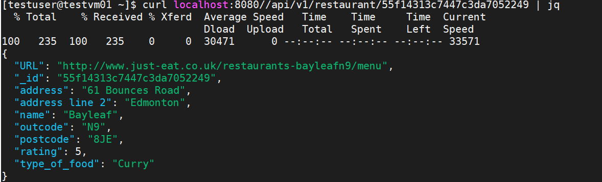
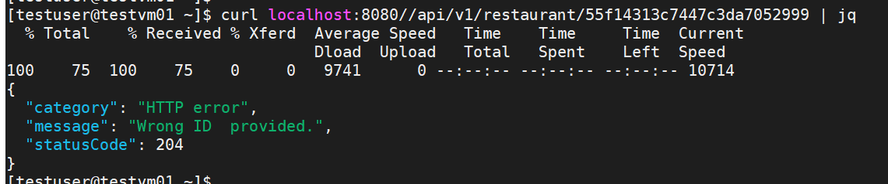

# **The real DevOps challenge Solution**

Please find the below solutions for the all challenges.

### Challenge 1. The API returns a list instead of an object

#### /api/v1/restaurant/{id} 
This endpoint having an issue due to an undefined variable(id) in the mongoflsk.py file. So I changed the variable from id to _id in the file.

```bash
if _id:
  query["_id"] = ObjectId(_id)
```

#### Return a json object instead of a json array if there is a match or a http 204 status code if no match found
In this challenge, will check the output of the query. Based on this query, will send the return output. For the JSON object, used to get the first element of the list. So that will have the output of the JSON object

```bash
@app.route("/api/v1/restaurant/<id>")
def restaurant(id):
    restaurants = find_restaurants(mongo, id)
    if not restaurants:
        return jsonify(
                    message="Wrong ID  provided.",
                    category="error",
                    status=204
         )
    return jsonify(restaurants[0])

```




### Challenge 2. Test the application in any cicd system
In this challenge, we used the Gitlab-CI tool to automate the deployment of the app and created a new pipeline file for that.
 
```bash
Pipeline File - .gitlab-ci.yml.
```
In this pipeline, having 2 stages. 
* Test -  To test the application using tox package
* Deploy - - To deploy the application (Here just installing the app requirements)

If I commit any changes in the repo, automatically will start the pipeline to deploy the solution. 


### Challenge 3. Dockerize the APP
Here used python image and added some instructions to run the app. Please refer to the Dockerfile for the containerized app.
```bash
App DockerFile - Dockerfile
```

### Challenge 4. Dockerize the database
I used Dockerfile to create the MongoDB image with help of the import script (import the data). 
```bash
DB DockerFile - data/Dockerfile
```
### Challenge 5. Docker Compose it
In this challenge, created a docker-compose.yml file with the help of a previously created app and DB image. Here app having an environment variable and It's referring to the DB container. 
```bash
DockerCompose File - docker-compose/docker-compose.yml
```
### Final Challenge. Deploy it on kubernetes
Here we used minikube to deploy the app on the Kubernetes. Please find the below deployment file to deploy the app. 
* mongo.yml - To deploy the DB using our customized image with the host volume. 
* mongo-svc.yml - To create the service for the DB 
* app.yml - To deploy the app using our customized image and it has an environment variable. It's referring to the DB service. 
* app-svc.yml - To create the service for the app and its expose as a ClusterIP. So that can browse the page from the minikube box. If you want, can expose it as NodePort and can browse using the Node IP.

```bash
Deployment Files: kubernetes/*.yml
```